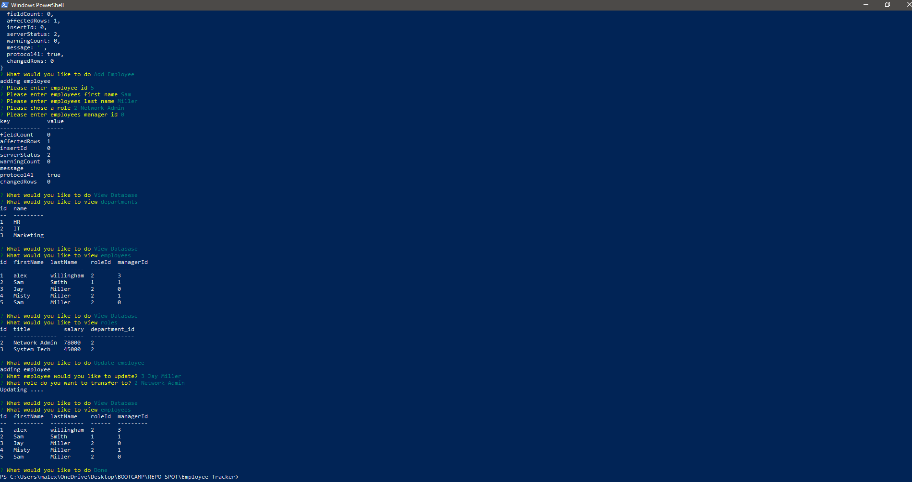

# Employee-Tracker


Developers are often tasked with creating interfaces that make it easy for non-developers to view and interact with information stored in databases. Often these interfaces are known as **C**ontent **M**anagement **S**ystems.
This is a command-line application that allows the user to:  Add departments, roles, employees, view departments, roles, employees, and update employee roles

## Table of Contents
* [User story](#User_story)
* [Installation](#Installation)
* [Usage](#Usage)
* [Demo](#Demo)
* [Submissions](#Submissions)
## User story

```
As a business owner
I want to be able to view and manage the departments, roles, and employees in my company
So that I can organize and plan my business
```


## Installation
* Pull this repo to your local drive then using terminal/shell cd into the root directory of the repo.

* Then run npm i to install all dependancies listed in the package.json folder dependancies are as follows

* Use the [MySQL](https://www.npmjs.com/package/mysql) NPM package to connect to your MySQL database and perform queries.

* Use [InquirerJs](https://www.npmjs.com/package/inquirer/v/0.2.3) NPM package to interact with the user via the command-line.

* Use [console.table](https://www.npmjs.com/package/console.table) to print MySQL rows to the console. There is a built-in version of `console.table`, but the NPM package formats the data a little better for our purposes.
*  Once packages are installed run `node app.js` to launch the app.

## Usage 

 a command-line application that allows the user to:

  * Add departments, roles, employees

  * View departments, roles, employees

  * Update employee roles

## Demo




## Submissions


GitHub repository: https://github.com/malex19889/Employee-Tracker.git

Video demonstrating the entirety of the app's functionality: https://drive.google.com/file/d/1929C3RmpJy_0-PzZ7cY86pZbQMFnDMS5/view


